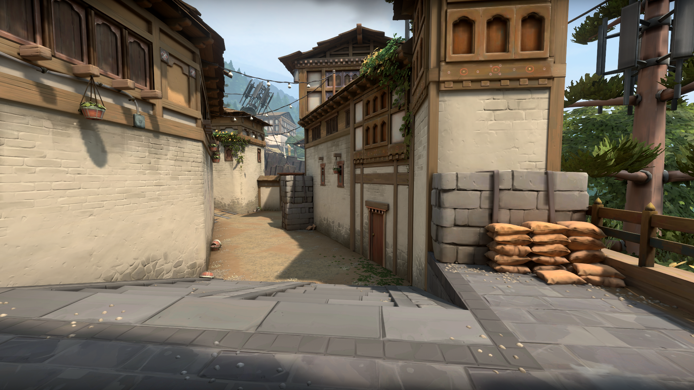
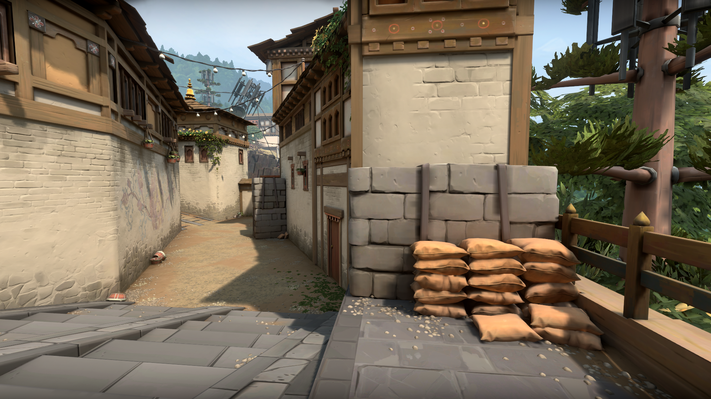
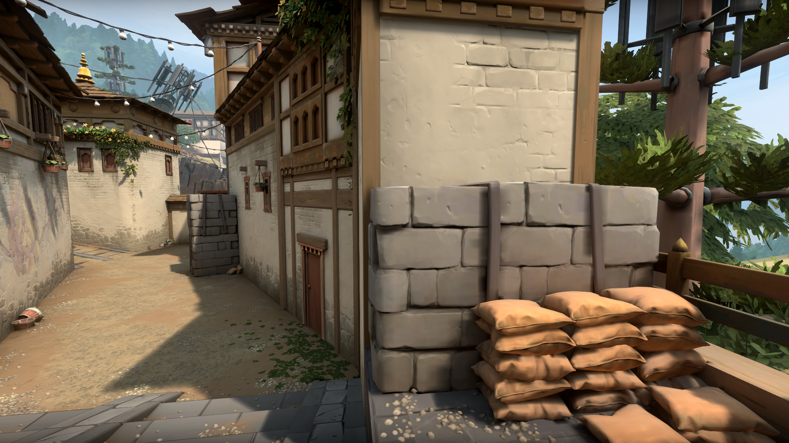
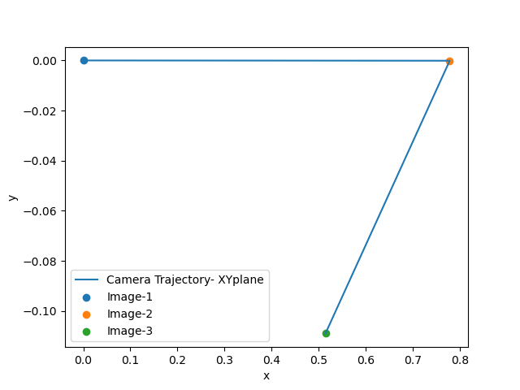
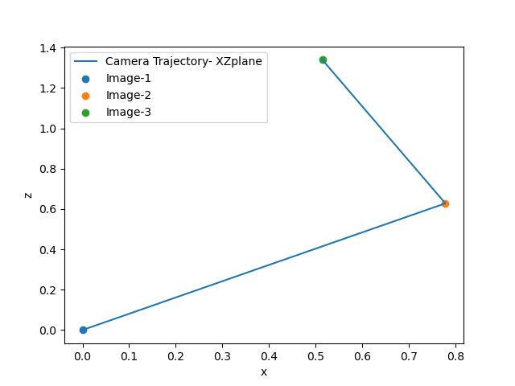
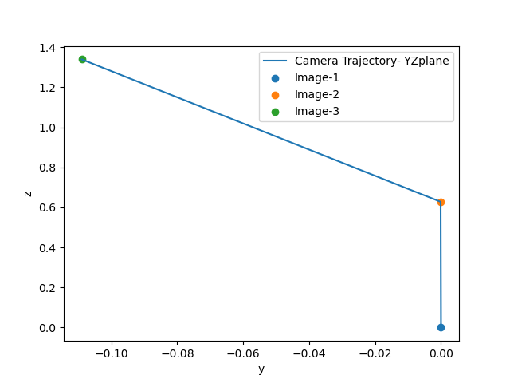

<h3 align="center">Camera Pose Estimater: 4D-Sight Technical Interview Task</h3>

<div align="center">

</div>

---

<p align="center"> In this project, 6 DoF of cameras are calculated for the given images and groun truth simulation data.
    <br> 
</p>


## 🏁 Installing 

A step by step series of examples that tell you how to get a development env running.

```
cd /path/to/the/project
pip install -r ./requirements.txt
```

## 🏁 Running 
For the basic usage following code can be run.

```
python3 main.py
```

## 🏁 Task Details

As starting points, besides image and object points following images are given.




## 🏁 Algorithm Details
Feature Matchign based pose estimation is done. Here are the details.
- Camera calibration is made upon given object and image points.
- SIFT is used as feature extracter.
- Extracted features are matched by Brute Force Matching.
- Based on matched features rotation and translation matrixes are estimated.
- Extracted rotation and translations are normalized with respect to image 1.

Besides Feature matching method, one should be capable of estimate the points by optical flow.
- By the help of perspective-n-point, and optical flow method it is theoritically possible. For further studie, it can be studied. 

## 🏁 Results





### Extimated Camera Calibration
[Camera Intrinsic Calibration](./results/CameraCalibRationMatrix.txt)

### Rotation and Translation of Image 2 wrt Image 1
[Rt2](./results/Rt2.txt)
### Rotation and Translation of Image 3 wrt Image 1
[Rt3](./results/Rt3.txt)

## 🎉 Acknowledgements <a name = "acknowledgement"></a>

- Carnegie Mellon University, Kris Kitani Pose Estimation Lecture Notes
- University of Utah, Srikumar Ramalingam Camera Pose Estimation Lecture Notes
- OpenCV documentation on Homography